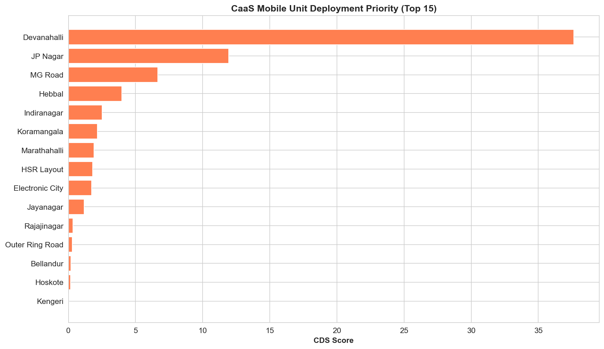
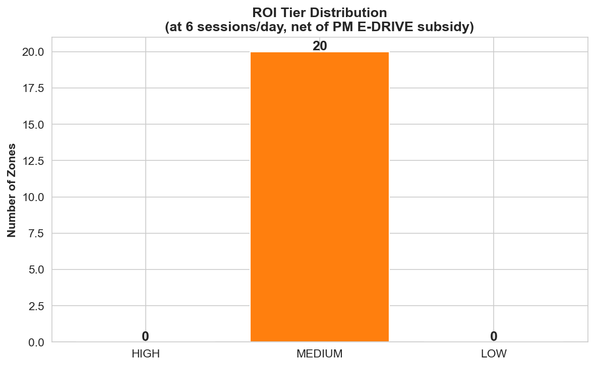
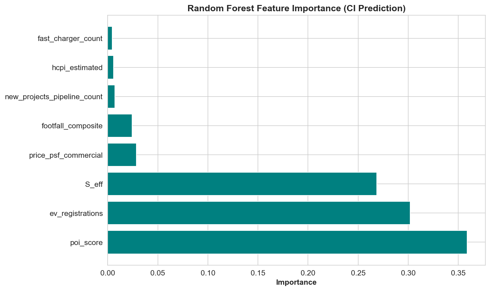
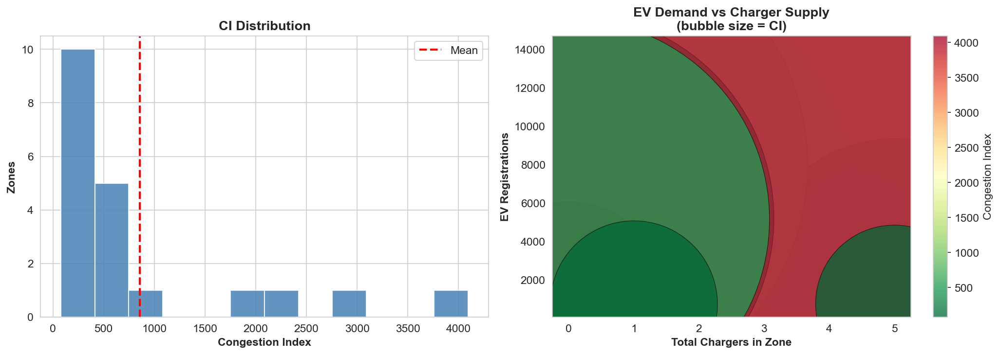
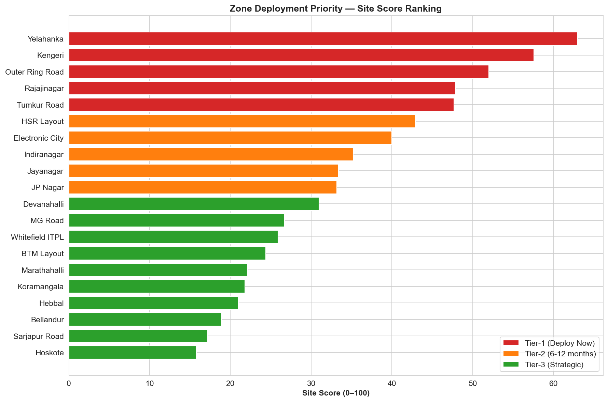

# ⚡ EV Charging Demand Intelligence Platform

## 🚀 Overview

The EV Charging Demand Intelligence Platform is an AI-powered predictive analytics system designed to solve one of the biggest problems in India's EV ecosystem:

> "Where should EV charging stations actually be deployed?"

The platform combines:

- Predictive Analytics
- Geospatial Intelligence
- Machine Learning
- Time-Series Forecasting
- Financial Viability Modeling
- Infrastructure Planning

to generate intelligent deployment recommendations for EV charging infrastructure.

---

# 🎯 Problem Statement

India’s EV adoption is growing rapidly, but charging infrastructure deployment remains inefficient and reactive.

Current deployment suffers from:

- Overcrowded charging hotspots
- Underutilized charging stations
- Charging deserts in high-growth corridors
- Poor investment allocation
- Lack of demand-driven placement intelligence

This project develops a predictive decision-support platform capable of identifying:

✅ High-demand charging zones  
✅ Future congestion hotspots  
✅ Optimal charging station deployment locations  
✅ Mobile charging deployment opportunities  
✅ CAPEX and OPEX optimization strategies

---

# 🧠 Core Innovation

The framework introduces a dual-output decision architecture:

## 1️⃣ Congestion Index (CI)

Determines:

> Where should permanent charging stations be built?

Optimized for:

- Long-term infrastructure deployment
- CAPEX optimization
- 5-year investment recovery

---

## 2️⃣ CaaS Deployment Score (CDS)

Determines:

> Where should mobile charging units be deployed this week?

Optimized for:

- Weekly deployment decisions
- Transient demand spikes
- Revenue maximization

---

# 🏗️ System Architecture

## Seven-Module Data Pipeline

```text
1. EV Demand Collection
2. Charger Supply Aggregation
3. POI Intelligence Layer
4. Footfall Estimation
5. Land Cost & Real Estate Layer
6. Geospatial Compiler
7. Statistical Verification
```

---

# 🔄 Predictive Pipeline

```text
Cluster → Score → Forecast → Rank
```

---

## Phase 1 — Geospatial Clustering

### DBSCAN Clustering

Used for:

- Demand zone discovery
- Charging desert identification
- Irregular spatial pattern detection

Output:

- Demand clusters
- High-priority underserved zones

---

## Phase 2 — Congestion Scoring

### Congestion Index (CI)

```text
(P_EV × G_predicted) /
[(C_slow + 3×C_fast) × S_grid]
```

Measures:

- EV density
- Predicted growth
- Charger availability
- Grid stability

---

### CaaS Deployment Score (CDS)

```text
[(Footfall × EV_density × (1 + Fast_Desert_Flag))] /
(1 + Planned_Supply_6mo)
```

Measures:

- Short-term demand
- Commercial activity
- Charging competition
- Temporary deployment opportunities

---

## Phase 3 — Time Series Forecasting

### Prophet Forecasting

Used for:

- 12-month EV growth forecasting
- Demand trend analysis
- Policy-change modeling

Special changepoints:

- FAME-II
- PM E-DRIVE

---

## Phase 4 — Machine Learning Ranking

### XGBoost Ranking Engine

Ranks zones using:

- EV growth
- Footfall
- POI density
- Grid stability
- Land economics
- Supply-demand gaps

---

# 📊 Key Features

- ⚡ EV charging congestion prediction
- 🗺️ Geospatial clustering
- 📈 Demand forecasting
- 🤖 Machine Learning ranking
- 🧠 Infrastructure intelligence
- 📍 Charging desert detection
- 🚗 Mobile charging optimization
- 💰 Financial ROI modeling
- 🏙️ Urban demand analysis
- 📊 Infrastructure planning dashboard

---

# 🧩 Tech Stack

| Category | Technology |
|---|---|
| Programming | Python |
| ML Models | XGBoost |
| Forecasting | Prophet |
| Clustering | DBSCAN |
| Geospatial Analytics | GeoPandas |
| Visualization | Matplotlib / Plotly |
| Web Automation | Selenium |
| Data Collection | APIs + Web Scraping |
| Statistical Validation | PCA, VIF, Moran’s I |
| Notebook Environment | Jupyter / Google Colab |

---

# 📁 Project Structure

```text
EV-Charging-Demand-Intelligence-Platform/
│
├── data/
├── notebooks/
├── pipeline/
├── reports/
├── presentations/
├── screenshots/
├── README.md
├── requirements.txt
└── LICENSE
```

---

# 📸 Screenshots

## CaaS Mobile Unit Deployment



---

## ROI Tier Distribution



---

## Feature Importance



---

## EV Demand vs  charger supply



---

## Zone Deployment Priority



---

# ⚙️ Installation

## Clone Repository

```bash
git clone https://github.com/YOUR_USERNAME/EV-Charging-Demand-Intelligence-Platform.git
```

---

## Navigate to Project Directory

```bash
cd EV-Charging-Demand-Intelligence-Platform
```

---

## Install Dependencies

```bash
pip install -r requirements.txt
```

---

# ▶️ Running the Pipeline

Run the full predictive analytics pipeline:

```bash
python pipeline/run_full_pipeline.py
```

The pipeline performs:

- Data ingestion
- Spatial clustering
- Feature engineering
- Forecasting
- Ranking
- Scoring
- Visualization generation

---

# 📊 Statistical Validation

The framework uses:

- Variance Inflation Factor (VIF)
- Principal Component Analysis (PCA)
- Moran’s I Spatial Correlation
- RMSE
- MAE
- MAPE
- R² validation metrics

---

# 📈 Model Performance

The Bengaluru pilot achieved:

| Metric | Value |
|---|---|
| RMSE | 13.02 |
| MAE | 4.17 |
| MAPE | 19.44 |
| R² | 60.63% |

---

# 🧠 Business Value

The platform enables:

## For CPOs (Charge Point Operators)

- Smarter charging station placement
- Reduced stranded CAPEX
- Faster payback periods
- Demand validation before deployment

---

## For Mobile Charging Operators

- Dynamic weekly routing
- Revenue optimization
- Demand spike targeting

---

## For Policymakers

- Infrastructure gap analysis
- Smart subsidy allocation
- EV ecosystem planning

---

# 💡 Example Use Cases

- EV infrastructure planning
- Smart city charging intelligence
- Highway corridor optimization
- Fleet charging deployment
- Commercial hub analysis
- Charging desert detection

---

# 🔮 Future Enhancements

- Real-time live traffic integration
- IoT-enabled charger analytics
- Reinforcement learning optimization
- Deep learning demand prediction
- Cloud deployment on Azure/AWS
- Real-time dashboarding
- API-based deployment engine

---

This project contributes:

✅ Dual CAPEX/OPEX decision framework  
✅ CaaS demand-validation architecture  
✅ Charging desert intelligence  
✅ Policy-aware forecasting  
✅ Micro-zone EV infrastructure analytics


# 📄 Reports & Documentation

Included in this repository:

- Predictive Analytics Project Report
- EV Consulting Report
- Data Collection Playbook
- Presentation Decks
- Pipeline Architecture

---

# 📜 License

This project is developed for academic and research purposes.

---

# ⭐ Support

If you liked this project:

⭐ Star the repository  
🍴 Fork the repository  
📢 Share feedback

---

# 🚀 Final Note

This project combines:

```text
Machine Learning + Predictive Analytics + Geospatial Intelligence + EV Infrastructure + Financial Modeling
```

to build a next-generation intelligent decision-support platform for EV charging infrastructure deployment.
